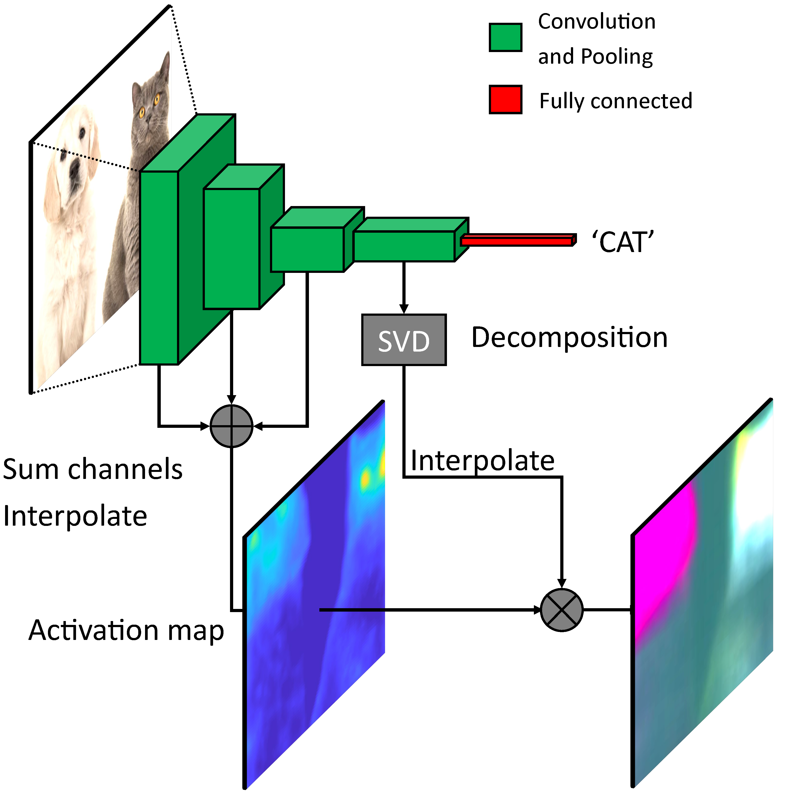
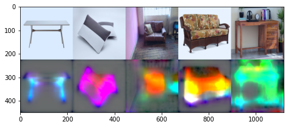
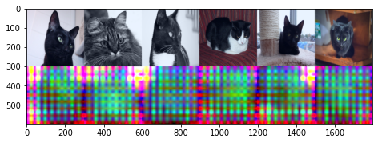
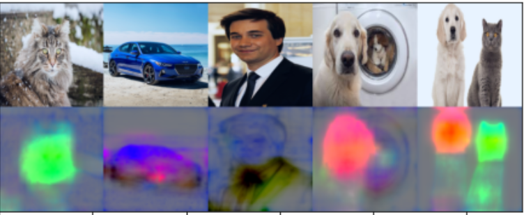
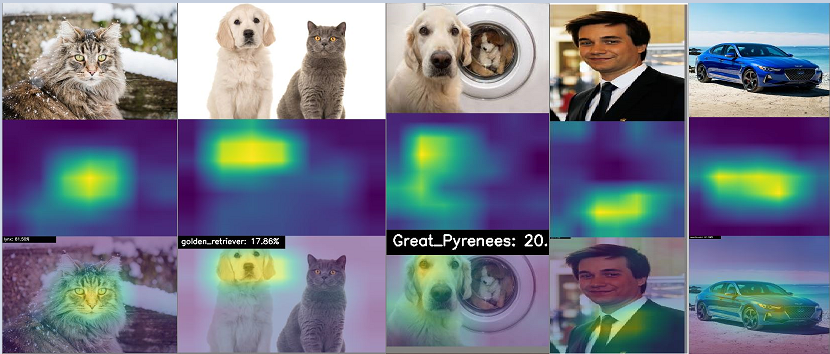

# Machine Learning Reproducibility Challenge 2020
The aim of the project is to establish and validate the reproducibility of the work on "Principal Feature Visualisation in Convolutional Neural Networks" by Marianne Bakken, Johannes Kvam, Alexey A. Stepanov, Asbjørn Berge. The work is a part of ECCV 2020. The paper can be found here: https://www.ecva.net/papers/eccv_2020/papers_ECCV/papers/123680018.pdf

# Principal-Feature-Visualization
Principal feature visualization is a visualization technique for convolutional neural networks that highlights the contrasting features in a batch of images. It produces one RGB heatmap per input image.


Credit: Image has been taken from the main paper. <br/>
## About the Repo
This repo contains the following files and folders:

- **Grad Cam** folder Contains scripts for running the Grad Cam (another type of Visualization technique) along with the folders where you can put images and view results.
- **Images** folder contains all the different images used during the experiment.
- **Results** folder contains results for various kinds of objects and things along with results of different CNN models tried on Principal Feature Visualization technique. 
- **Sample Images** folder where one can put images to try PFV technique on. 
- **PFV.py** is the python script for the Principal Feature Visualization(PFV) technique.
- **Demo.py** is used to run the PFV script where you can modify different models and adjust dataset and preprocessing(if require).
- **Demo.ipynb** same as demo.py script 
- **Requirement.txt** contains all the libraries you need to run the scripts.

*Note* All the images for this experiment are taken from Open Images Dataset v6.

## Dependencies
* pytorch
* numpy

### Additional dependencies for the demo:
* torchvision
* matplotlib
* pillow

## How to use 
Make sure you have all the dependencies required to run the project(mentioned in Requirement.txt file).

Add images to the 'Sample Images' folder which you want to visualize. 

Run the example in demo.py: `python demo.py` Or  You can use the ipynb notebook to view what each line of code is doing. 
 
 **Important :** In file 'demo.py' and you can change the pretrained model weight as well by changing the line 
 ```python
model = models.vgg16(pretrained=True)
```
By default model is vgg16. If you wish to change details can be found [here](https://pytorch.org/docs/stable/torchvision/models.html) .

## Results 
Here are all the insights which we managed do get during the experiment.

PFV on various images of Cats| PFV on various Vehicle images
:-------------------------:|:-------------------------:
  |  

We can clearly see that this technique is able to identify and highlight key features in the images. And as observed it is able to identify most of the common objects,vehicles,humans and animals. (Also different colors represent different features.) More results can be found [here](https://github.com/abhinav0000004/Principal-Feature-Visualization/tree/main/Results) .

Apart from different things we tried this technique on various types of CNN models and few outputs are :

PFV on Alexnet| PFV on Wide ResNet
:-------------------------:|:-------------------------:
  |  

More can be found [here](https://github.com/abhinav0000004/Principal-Feature-Visualization/tree/main/Results/VariousModels) .

**Here are some of unexpected results:**

Model fails to identify objects like table,chair,sofa,etc.



Also we tried running the model in Inception networks and here is the result which we got as an output- 



## Comparision with Grad Cam 

We tried running the images on two different visualisation techniques i.e Grad-Cam and Principal Feature Visualization and here are the results.

### For Principal Feature Visualisation 


### For Grad Cam


## The paper
This method was presented at ECCV 2020. Please see [the full paper](https://www.ecva.net/papers/eccv_2020/papers_ECCV/papers/123680018.pdf) and [supplementary material](http://www.ecva.net/papers/eccv_2020/papers_ECCV/papers/123680018-supp.pdf) for more information about our method.

## Now we are working on converting the pytorch code into TensorFlow in order to understand technique in-depth and to iporve its performance. Any help/collaboration would be appreciated .
